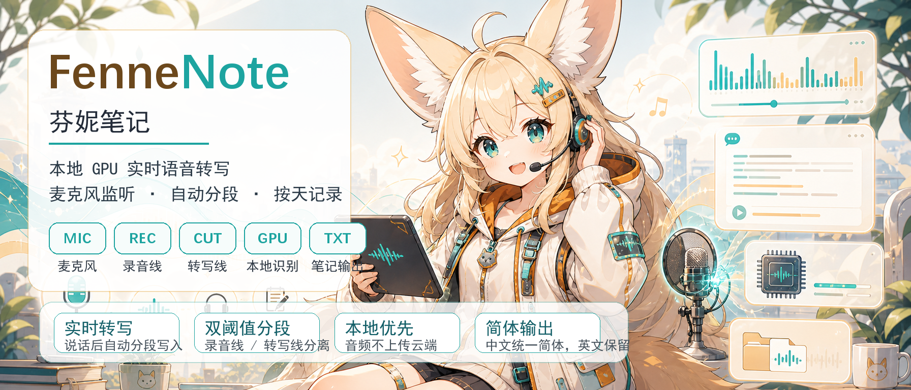

# FenneNote

<p align="center">
  
</p>

<h3 align="center">芬妮笔记：本地 GPU 实时语音转写工具</h3>

<p align="center">
  常驻监听麦克风，按语音活动自动切段，用本地 GPU Whisper 转写，并按日期写入文本。
</p>

## 这是什么

FenneNote 是一个面向 Windows 桌面的实时语音笔记工具。它适合办公室里做持续语音备忘、会议碎片记录、开发时的口述想法记录，也可以作为 RabiRoute 的语音输入端。

项目形象采用耳廓狐娘方向：大耳朵代表灵敏听觉，耳机麦克风代表实时监听，沙金色和青绿色波形代表温暖但偏工具化的桌面助手气质。

## 功能

- Windows 中文 GUI，支持开始、暂停、停止和实时预览。
- 固定 GPU / CUDA 模式，默认 `small + int8_float16`，兼顾 8GB 显存和 Unity 同时运行。
- Whisper 模型不随工具打包，可在 GUI 的“模型”页下载、删除和检查本地缓存。
- 麦克风音量监测、滚动柱状波形、录音线和转写线。
- 录音触发阈值与转写判定阈值分离，支持动态底噪。
- 触发前保留音频，减少句首丢字。
- 低于转写线一段时间后自动切段并转写。
- 中文输出简体，英文术语保留。
- 按天写入 `transcripts/YYYY-MM-DD.txt`。
- 模型、临时缓存、配置和输出默认都放在安装目录下。
- 可选推送转写事件到 RabiRoute 的 `voice_transcript` 路由。
- 可接收 RabiRoute/Agent 反向消息，并在屏幕左下角弹出气泡。

## 快速上手

要求：

- Windows 10/11
- Python 3.10
- NVIDIA GPU
- CUDA 11.8 运行库，或机器上已有可被脚本加入 `PATH` 的 cuDNN/CUDA DLL

启动 GUI：

```powershell
cd C:\Data\CottonProject\FenneNote
.\run_gui.ps1
```

第一次运行会自动创建 `.venv-gpu`，安装 GPU 依赖，并从 `config.example.json` 创建本机 `config.json`。

打开后：

1. 在“输入”页选择麦克风。
2. 保持默认 `small`、`GPU / CUDA`、`int8_float16`。
3. 打开“模型”页，选择并下载需要的 Whisper 模型。
4. 回到“输入”页，确认下拉框选择了要使用的模型。
5. 在主界面确认麦克风波形有变化。
6. 点击“开始”。
7. 说话后在“转写预览”查看文本，完整记录会写入 `transcripts/`。

更多细节见 [快速上手](docs/QUICK_START.md)。

## 常用入口

GUI：

```powershell
.\run_gui.ps1
```

终端版：

```powershell
.\run.ps1
```

打包 Windows exe：

```powershell
.\build_windows.ps1
.\dist\FenneNote\FenneNote.exe
```

列出麦克风设备：

```powershell
.\.venv-gpu\Scripts\python.exe .\transcribe_mic.py --list-devices
```

## 文档

- [快速上手](docs/QUICK_START.md)
- [配置说明](docs/CONFIGURATION.md)
- [RabiRoute 接入](docs/RABIROUTE.md)
- [排错指南](docs/TROUBLESHOOTING.md)

## 目录和数据

运行期文件默认保存在程序所在目录：

```text
config.json         本机配置
transcripts/        按天保存的转写文本
cache/models/       Whisper 模型缓存
cache/huggingface/  Hugging Face 下载缓存
cache/temp/         临时文件
cache/audio/        预留音频临时缓存
```

源码运行和打包版运行会分别读取各自目录下的 `config.json`。如果同时使用 `.\run_gui.ps1` 和 `dist\FenneNote\FenneNote.exe`，它们的配置互不共享。

当前 GUI 可管理的模型：

```text
tiny.en, tiny, base.en, base, small.en, small,
medium.en, medium, large-v1, large-v2, large-v3, large
```

## 开发验证

```powershell
py -3.10 -m py_compile gui.py transcribe_mic.py
```

构建 exe：

```powershell
.\build_windows.ps1
```

`dist/`、`build/`、`.venv-gpu/`、`config.json`、`transcripts/`、`cache/`、`reference-cache/` 不提交到 GitHub。

## 角色资产

- README 主视觉：[assets/fennenote-readme-banner.png](assets/fennenote-readme-banner.png)
- 角色设定图：[assets/fennec-mascot-sheet.png](assets/fennec-mascot-sheet.png)
- 窗口图标：[assets/fennenote.ico](assets/fennenote.ico)
- 状态差分：`assets/fennenote-state-*.png`
