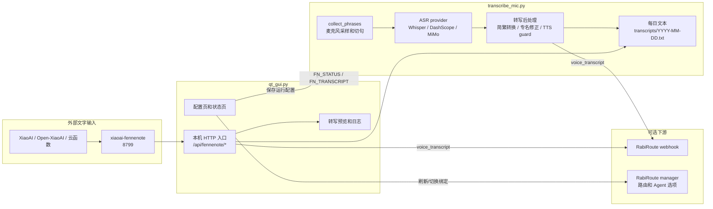
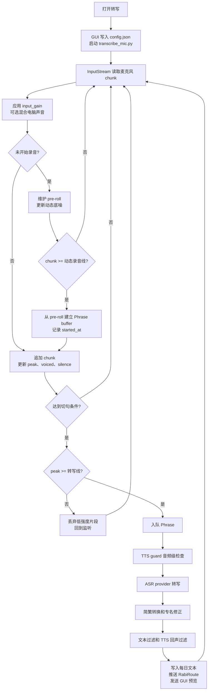
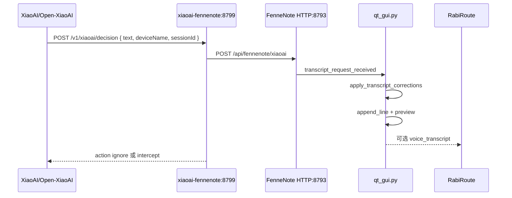

# 录音与转写架构

本文记录 FenneNote 当前录音、切句、转写、外部文字接入和 RabiRoute 推送链路。目标是让录音事实、转写事实和界面表现各有归口，避免后续把麦克风输入、小爱文本、ASR provider、声纹识别和 UI 反馈混成一团。

## 模块分工

| 模块 | 负责 | 不负责 |
| --- | --- | --- |
| `qt_gui.py` | 配置采集、界面状态、外部 HTTP 入口、转写预览、启动/停止后台进程 | 直接做麦克风切句、直接调用本地 Whisper、保存真实模型缓存 |
| `transcribe_mic.py` | 麦克风采样、动态阈值、切句、ASR 调度、转写后处理、写入每日文本、RabiRoute 推送 | 管理 GUI 控件、小爱桥接运行时、外部文字 HTTP 服务 |
| `rabiroute_sdk.py` | 读取 RabiRoute manager 的实例、路由和 Agent 选项 | 保存 FenneNote 转写配置、发送 voice transcript webhook |
| `plugin-adapters/xiaoai-fennenote` | 把小爱/Open-XiaoAI 文本转发给 FenneNote，按规则返回 `ignore` 或 `intercept` | 直接控制 FenneNote GUI、自己做 ASR、保存 FenneNote 转写记录 |

配置的唯一真源是 `config.json`。GUI 通过 `collect_config()` 生成运行配置；后台转写进程只读取启动时写入的配置快照。外部文字模式没有原始音频，因此不会做声纹识别、说话人分离或音频级 TTS 防回流。

## 总体架构



## 麦克风录音流程



切句由三组状态共同决定：

- `record_threshold`：进入录音窗口的最低门槛，动态阈值只在未开始录音时抬高它。
- `transcribe_threshold`：片段能否进入 ASR 的门槛，低于它的背景声不会送去转写。
- `transcribe_pause_seconds` / `silence_seconds` / `max_phrase_seconds`：分别处理正常停顿、长时间低声噪音和超长句。

## 外部文字流程



`decision` 默认只负责转发并返回 `ignore`，让小爱原生响应继续。只有配置 `XIAOAI_INTERCEPT_REGEX` 且文本命中时，桥接器才返回 `intercept`。

## 维护原则

- 录音采样和切句只放在 `collect_phrases()`，GUI 只显示阈值和状态。
- ASR provider 的差异收敛在 `transcribe_phrase_with_*()`，共同输出纯文本。
- 转写后处理统一走 `apply_transcript_corrections()`，麦克风和外部文字都复用同一规则。
- `append_line()` 是每日文本写入入口，RabiRoute 推送只通过 `post_rabiroute_event()`。
- 外部文字不伪装成音频识别结果；它可以写入和推送，但没有音频、峰值、声纹和 speaker turns。
- 普通麦克风转写停止时不管理小爱桥接进程；只有外部文字模式停止才尝试停止相关桥接运行时。

## 验证清单

发布前至少执行：

```powershell
py -3.10 -m py_compile qt_gui.py transcribe_mic.py rabiroute_sdk.py
node --check plugin-adapters/xiaoai-fennenote/index.mjs
```

有本机依赖时可继续做：

```powershell
.\.venv-gpu\Scripts\python.exe .\transcribe_mic.py --list-devices
npm --prefix .\plugin-adapters\xiaoai-fennenote run smoke
```

真实语音验证重点看三件事：轻声噪音不入队、正常说完后按 `transcribe_pause_seconds` 切句、TTS guard 生效时不会把本机回声写入转写。
